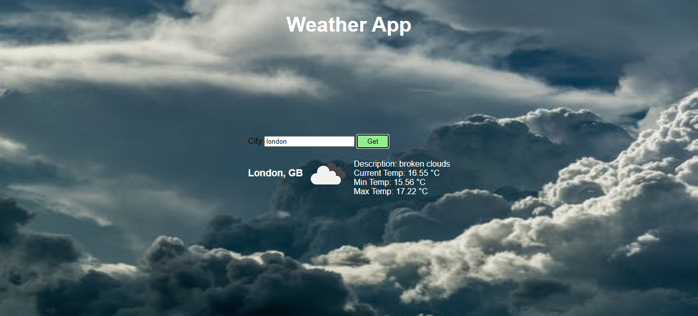

# Weather App
A javascript application which uses OpenWeatherMap API to get weather data of a city and displays it.
App uses javascript Fetch API to make asynchronous GET request to OpenWeatherMap API.
> JavaScript App to get weather data.

## Built With

- HTML,
- CSS,
- JavaScript
- OpenWeatherMap API

## Live Demo

[Live Demo Link](https://raw.githack.com/alishabab/weather-app/development/index.html)

## Getting Started

To get a local copy up and running follow these simple example steps.

### Prerequisites

You should have installed git on your local machine and a text editor preferably VS Code.

### Setup

- Clone the repository into your local machine.
- Open index.html

## Authors

👤 **Author**

- Github: [@alishabab](https://github.com/alishabab)
- Twitter: [@shabab_ali](https://twitter.com/shabab_ali)
- Linkedin: [Shabab Ali](https://www.linkedin.com/in/shababali/)

## 🤝 Contributing

Contributions, issues and feature requests are welcome!

Feel free to check the [issues page](issues/).

## Show your support

Give a ⭐️ if you like this project!

## Acknowledgments

- [OpenWeatherMap.org](https://openweathermap.org/)

## 📝 License

This project is [MIT](lic.url) licensed.
